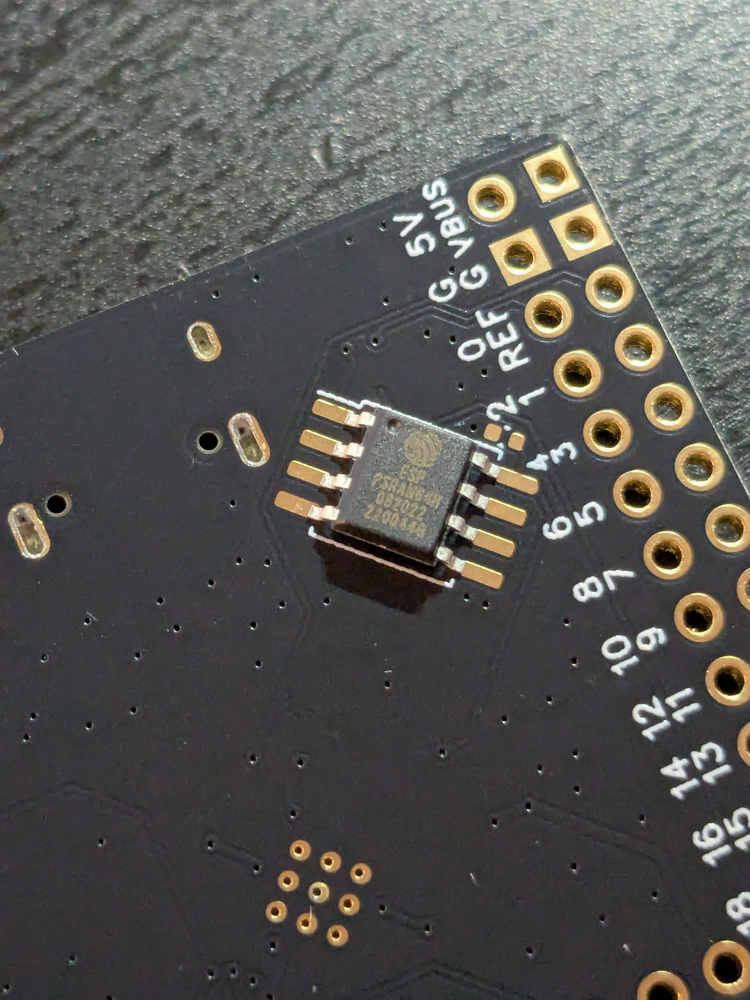
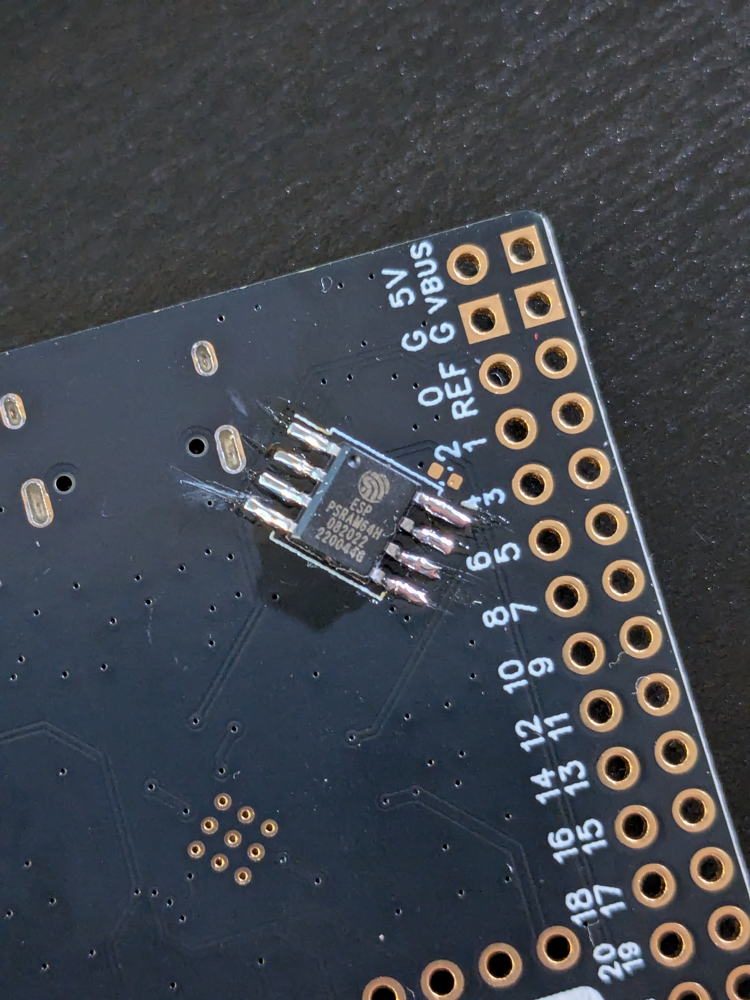

# weact-rp2350b-psram-micropython

The RP2350 is a powerful 32-bit dual-core microcontroller designed by Raspberry Pi Ltd. What makes it truly unique is its configurable architecture, allowing developers to choose between ARM Cortex-M33 and/or Hazard3 RISC-V cores. This flexibility opens up a wide range of possibilities, catering to both ARM and RISC-V enthusiasts.

With this hybrid core setup, the RP2350 can support different development workflows, whether you prefer the well-established ARM ecosystem or want to dive into the open-source RISC-V world. This makes it a fantastic choice for embedded systems, IoT devices, and educational projects.

With 520 KB of SRAM and 16 MB of QSPI Flash, this board is well-equipped to handle a variety of embedded applications. Whether you're working on real-time tasks, experimenting with low-power computing, or diving into RISC-V development, the RP2350B offers plenty of headroom.

One of its standout features is its 48 GPIO pins, giving you extensive flexibility for interfacing with sensors, actuators, displays, and more. This board is designed to be fully open—all GPIOs are accessible, allowing you to take full advantage of its capabilities.

One of the great features of the WeAct RP2350B is its ability to support 8MB of PSRAM. This significantly expands the available memory, making it useful for applications that require larger buffers, such as image processing, machine learning, or advanced data handling.

However, at the moment, stock MicroPython does not yet support PSRAM on this board. To enable PSRAM functionality, we’ll be using a custom MicroPython branch from Pimoroni, which includes the necessary modifications to take full advantage of the extra memory.

Before enabling PSRAM support in software, the first step is to physically add, for example, the ESP-PSRAM64H chip to the board. The WeAct RP2350B has a designated spot on the flip-side of the PCB for this SOP8 package chip, and it’s important to ensure proper orientation before soldering.



For best results, it's recommended to use low-melting solder with a 60% tin, 40% lead composition. This type of solder makes it easier to achieve clean joints with less risk of overheating the chip. Since the ESP-PSRAM64H is quite small, a fine-tip soldering iron is essential for precise work.

Start by identifying the dot or marking on the chip, which aligns with the designated pin marker on the PCB. Proper alignment is crucial to avoid potential damage. If needed, apply a small amount of flux and pre-tin the solder pads to ensure better adhesion. Carefully position the chip and solder each pin, taking care not to apply excessive heat.

Once soldering is complete, inspect the connections closely. Using a magnifying glass or microscope can help spot any bridged pins or weak joints. A quick continuity test with a multimeter can further confirm that all connections are solid.



With the PSRAM chip securely in place, we can now move on to testing and compiling MicroPython with PSRAM support. Since the stock MicroPython firmware does not yet support PSRAM on the WeAct RP2350B, we will use a custom branch from Pimoroni that includes the necessary modifications.

To get started, clone the Pimoroni feature/psram branch by running the following commands:

```bash
git clone --branch feature/psram https://github.com/pimoroni/micropython.git
cd micropython
git submodule update --init --recursive
make -C mpy-cross
```

These commands will fetch the modified MicroPython source code, initialize any required submodules, and build the mpy-cross tool, which is needed for compiling MicroPython bytecode.

With the repository cloned and the submodules initialized, the next step is to copy the board definitions required for building the firmware with PSRAM support.

Here in this repo, inside the rp2/boards directory, you will find two board definition files specifically for the WeAct RP2350B with PSRAM support:

    WEACTSTUDIO_RP2350B_PSRAM (for ARM Cortex-M33)

    WEACTSTUDIO_RP2350B_RISCV_PSRAM (for Hazard3 RISC-V)

These board definitions ensure that the compiled firmware is properly configured to recognize and utilize the 8MB PSRAM. Copy these files into the appropriate location within the build system at ports/rp2/boards, as they will be referenced during the firmware compilation process.

Now that we have the necessary board definitions in place, it’s time to compile the MicroPython firmware with PSRAM support for the selected architecture.

Before running the build command, ensure that the appropriate compiler toolchain is installed and available in your $PATH.

For the ARM Cortex-M33 build, confirm that gcc-arm-none-eabi is installed and accessible. Then, compile the firmware using:

```bash
make V=1 BOARD=WEACTSTUDIO_RP2350B_PSRAM
```

For the RISC-V (Hazard3) build, ensure that riscv32-unknown-elf-gcc is available in your $PATH. Then, run:

```bash
make V=1 BOARD=WEACTSTUDIO_RP2350B_RISCV_PSRAM
```

If the compilation is successful, you will find a firmware.uf2 file in the build directory.

To flash the firmware onto your WeAct RP2350B board, enter bootloader mode (typically by holding the BOOTSEL button while connecting the board via USB), then copy the firmware.uf2 file to the mounted drive that appears.

Once flashing is complete, reset the board, and if everything went smoothly, you should see the MicroPython REPL prompt when connecting via a serial terminal.

To verify that the 8MB PSRAM is recognized, run the following in the MicroPython REPL:

```python
import gc
gc.mem_free()
```

or

```python
import micropython
micropython.mem_info(1)
```

If PSRAM is working correctly, you should see around 8MB of available RAM.

🎉 Congratulations! You now have a fully functional MicroPython setup on your WeAct RP2350B with PSRAM enabled! 🚀

If your board seems stuck and you’re not getting a REPL prompt after pressing Enter several times, there might be a hardware issue, particularly with the soldering of the PSRAM chip. Here are a few steps you can take to troubleshoot and fix the problem.

First, check the soldering. Since you manually soldered the ESP-PSRAM64H chip, it’s crucial to make sure all the connections are solid. Flip the board over and carefully inspect the area where the chip is mounted. Look closely for any bridged pins, where adjacent pins might be touching each other, which could cause a short circuit. A magnifying glass or microscope can help with this. Also, double-check that all the pins are properly soldered—any cold or weak joints could cause unreliable connections. If needed, use a multimeter to check continuity and make sure there are no shorts between adjacent pins.

If everything looks good but the board still isn’t working, try reflashing the firmware firmware.uf2 file again.

If the issue persists, it’s a good idea to test without PSRAM to isolate the problem. Flash the standard firmware (without PSRAM enabled) and see if the board works. If it does, but fails with the PSRAM firmware, that’s a clear sign the issue might be with the PSRAM chip or its soldering.

Also, don’t forget to check your power supply. Make sure the board is receiving sufficient power, as some peripherals may draw too much current, causing instability. Trying a different USB cable or using a powered USB hub might help here.

Finally, if all else fails, consider reflowing the PSRAM chip or even testing with a different PSRAM module. Troubleshooting can be a bit of trial and error, but these steps should guide you toward finding the problem. 

Now that your WeAct RP2350B is up and running with 8MB of PSRAM, we can take things a step further by customizing MicroPython to suit your specific needs. If you want to make modifications or update your MicroPython build, here’s how to do it.

First, start by cloning the latest MicroPython repository from GitHub. Once you’ve done that, you’ll need to run the following preliminary commands to set up your environment correctly:

```bash
git clone https://github.com/micropython/micropython.git 
cd micropython
git submodule update --init --recursive
make -C mpy-cross
```

Next, go to the rp2 directory of this repo and copy all the files from there into the micropython/ports/rp2 directory. Don’t forget to copy the boards directory as well, since it contains important configuration files for the board setup.

After copying the files, you’ll need to run the ```./copy_orig.sh``` script. This will make copies of certain files that we will modify during the build process, allowing you to maintain a clean original set of files for reference.

When everything is in place, it’s time to build the firmware for your board. To build the ARM firmware (with PSRAM support), simply run:

```bash
./mpb_weact_rp2350b_psram.sh
```

If you prefer to build the RISC-V firmware, then run:

```bash
./mpb_weact_rp2350b_riscv_psram.sh
```

These scripts will take care of the rest and create the necessary firmware files for your specific architecture.

Once the build completes, you can flash the new firmware to your board and, if all goes well, you’ll have a customized version of MicroPython running with your desired modifications.

The Pimoroni version will eventually be integrated into the standard MicroPython build, making the process much simpler in the future. Until then, it’s great to know how to customize the firmware and have full control over the build process.

I hope this guide has been helpful for your work with the WeAct RP2350B and PSRAM. Learning how to tweak and compile MicroPython is a valuable skill, especially when working with custom hardware. What I’ve shared here is what worked for me, but keep in mind that there might be other, perhaps even better, ways to achieve similar results. Always feel free to experiment and explore new approaches!

Oh, one more thing! I managed to overclock the board, and it seems to run stably with SPI-based PSRAM. Just wanted to share that in case you're interested in pushing the performance a bit further! 

```bash
>>> import machine
>>> machine.freq()
150000000
>>> machine.freq(260000000)
>>> 
```

Best of luck! 


